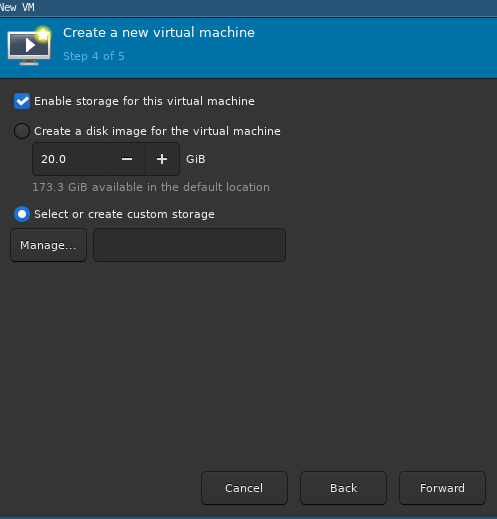
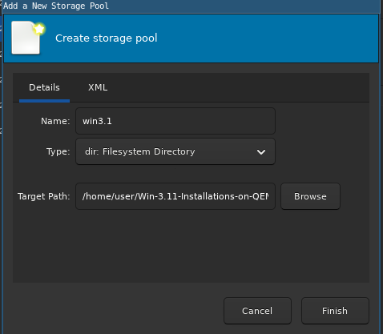
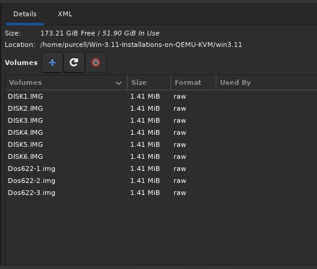
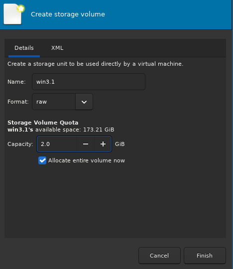

# Win-3.11-Installations-on-QEMU-KVM
Did you ever think how can we install WIndows's Operating System Old Versions?. Especially Win 3.11 

First things first we required the MS-DOS file. MS-DOS itself manages file storage, retrieval, and hardware operations, serving as the underlying foundation for early versions of Microsoft Windows. I've already offered inside win3.11 folder (`Dos622-1.img`, and so on). The second we need win3.11 file itself, I've already offered inside win3.11 folder as well (`DISK1.img` and so on).

Let's we start install:

## 1. Create a new virtual machine 

1. Choose Manual Install 

    

2. After you chosen that you'll lead to choose the operating system. Because Windows 3.11 doesn't exist on Qemu, we can just choose `Generic or unknown OS. Usage is not recommended.`

3. We allocated memory & CPUs. Depends on your want to, but, We'll go `Memory: 1024 MiB & CPUs: 1`

4. Create a custom storage, Since we need a litte configuration next steps

      
    Then, Click `Manage`.

5. You'll see at bottom-left corner, Just choose `Add pool or Plus Signs` 
    -   

    Then, Create pool, Choose `~/path/to/win.311/`

    - 

    -   

    Make sure the folder contains as above exhibit  
    Then, Create new volume upon `Plus signs besides Volume word`

    -   
    
    Allocated Capacity 2 GB or you can adjust as you like. And `Finish`
